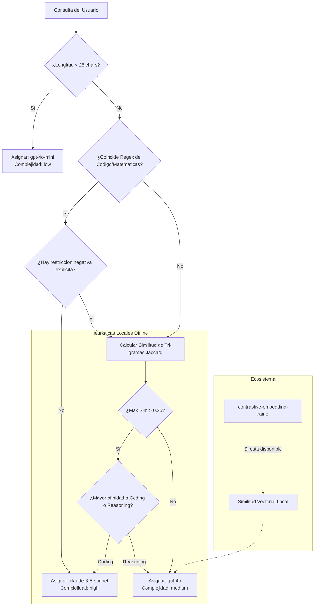

# Semantic Model Router

Enrutador semantico inteligente que analiza en tiempo real la complejidad logica y los requisitos de las consultas del usuario para derivarlas de forma dinamica al modelo de lenguaje (LLM) mas eficiente en relacion coste, latencia y precision.

Este componente reduce sustancialmente el coste operativo total de sistemas de produccion RAG (hasta un 70% de ahorro financiero) al derivar peticiones sencillas de chat o saludos a modelos ligeros y economicos (como `gpt-4o-mini`), reservando los modelos avanzados de alta capacidad intelectual (como `claude-3-5-sonnet`) para la resolucion de algoritmos, refactorizacion de codigo o razonamientos logico-deductivos complejos.

## Arquitectura y Algoritmos de Decision

El enrutador procesa cada consulta mediante un arbol de decision jerarquico de tres etapas, priorizando la ejecucion local, la baja latencia y la robustez offline.



### 1. Fase 1: Analisis Estructural y Regex Condicional

El enrutador ejecuta primero validaciones lexicas instantaneas que no consumen recursos de procesamiento pesado:

*   **Validacion de Longitud:** Si la consulta limpia tiene un tamano inferior a `25` caracteres (por ejemplo, saludos como "Hola", confirmaciones como "Si, gracias"), se clasifica de inmediato con complejidad `low` y se enruta a `gpt-4o-mini`.
*   **Inspeccion de Palabras Clave (Regex):** Se buscan patrones especificos asociados a programacion (`def`, `class`, `fn`, `struct`, etc.) o razonamiento matematico formal (`algoritmo`, `teorema`, `calculo`).
*   **Control de Negaciones:** Para evitar falsos positivos cuando el usuario pide explicitamente *no* codificar (ejemplo: "explicame como funciona RAG sin meter codigo"), se evalua una expresion regular de exclusion negativa:
    $$\text{PII\_Neg} = \text{re.search}(\text{"}\setminus b(sin|no|evitar|sin\ usar|sin\ meter)\setminus s+(codigo|programar|programacion|desarrollo)\setminus b\text{"})$$
    Si esta expresion coincide, se anula la derivacion directa a Claude y se continua con el analisis de la siguiente fase.

### 2. Fase 2: Similitud de N-Gramas Jaccard (Tri-gramas)

Cuando no hay una coincidencia lexica concluyente, el enrutador aplica una heuristica offline basada en n-gramas de caracteres de nivel 3 (tri-gramas). Este metodo mide el solapamiento entre los tri-gramas del prompt y un conjunto de anclas predefinidas que representan intenciones de alta complejidad:

*   **Tri-gramas:** Un texto se descompone en secuencias continuas de 3 caracteres eliminando espacios y normalizando a minusculas. Para el texto $T$, definimos su conjunto de tri-gramas como $G(T)$.
*   **Similitud de Jaccard:** Dadas la consulta del usuario $Q$ y un texto de anclaje $A$, la similitud se define como:
    $$J(Q, A) = \frac{|G(Q) \cap G(A)|}{|G(Q) \cup G(A)|}$$

El sistema evalua la similitud contra dos intenciones guia:
1.  *Coding Anchor:* `"Escribe un script de programacion para optimizar la funcion o el backend"`
2.  *Reasoning Anchor:* `"Realiza un analisis logico deductivo paso a paso de los datos financieros"`

Si $\max(J(Q, \text{Coding}), J(Q, \text{Reasoning})) > 0.25$, se selecciona el modelo con el perfil de capacidad intelectual adecuado para el ancla dominante (`claude-3-5-sonnet` o `gpt-4o`). En caso contrario, se enruta por defecto a `gpt-4o` para un procesamiento de proposito general.

### 3. Fase 3: Integracion con contrastive-embedding-trainer

El constructor del enrutador intenta realizar una importacion dinamica del proyecto hermano `contrastive-embedding-trainer` del espacio de trabajo. De encontrarlo disponible, el enrutador puede computar de forma local embeddings de la consulta y mapear la similitud de coseno frente a plantillas indexadas previamente en lugar de depender de la comparacion de tri-gramas, mejorando significativamente la precision de enrutamiento semantico bajo cargas de trabajo complejas.

## Modelos y Perfiles de Coste

El enrutador gestiona el presupuesto en funcion del coste de los tokens de entrada y salida ($Cost = \alpha \cdot \text{Cost}_{\text{input}} + (1.0 - \alpha) \cdot \text{Cost}_{\text{output}}$). Por defecto se utiliza una relacion estandar de consumo de tokens en tareas RAG ($\alpha = 0.75$):

| Modelo | Capacidad Intel. (1-10) | Latencia | Coste Input / 1K Tokens | Coste Output / 1K Tokens | Coste Ponderado P.D. |
| :--- | :---: | :---: | :---: | :---: | :---: |
| **gpt-4o-mini** | 4 | Baja | \$0.00015 | \$0.00060 | \$0.0002625 |
| **gpt-4o** | 8 | Media | \$0.00500 | \$0.01500 | \$0.0075000 |
| **claude-3-5-sonnet** | 10 | Alta | \$0.00300 | \$0.01500 | \$0.0060000 |

## Conexión con el Ecosistema

Este enrutador se integra en la infraestructura de la siguiente forma:
1.  **contrastive-embedding-trainer:** Aporta el modelo local Bi-Encoder para codificar consultas semanticas y buscar la intencion en espacios de alta dimensionalidad.
2.  **llm-inference-server:** Una vez que el router decide que modelo usar, las llamadas a modelos locales se derivan al servidor de inferencia local para su procesamiento.
3.  **orchestra-agents:** Actua como la compuerta de entrada para las peticiones de los agentes, permitiendo que la generacion de razonamientos de los agentes intermedios no gaste cuotas innecesarias de modelos propietarios avanzados.

## Estructura del Proyecto

*   `router.py`: Implementacion de la clase `SemanticModelRouter` y los esquemas de datos Pydantic para decisiones de enrutamiento (`RoutingDecision`).
*   `test_router.py`: Pruebas unitarias que validan la clasificacion de complejidad (low, medium, high), el calculo de similitud de Jaccard y las exclusiones por regex.
*   `example.py`: Demostracion interactiva de simulacion de enrutamiento sobre multiples prompts de prueba, calculando y mostrando el porcentaje exacto de ahorro financiero proyectado.

## Instalacion y Ejecucion

### 1. Configurar el Entorno e Instalar Dependencias

Asegurese de inicializar y activar el entorno virtual local antes de proceder con el uso del enrutador:

```bash
python3 -m venv .venv
source .venv/bin/activate
pip install -r requirements.txt
```

### 2. Ejecutar Pruebas Unitarias

```bash
.venv/bin/python -m unittest test_router.py
```

### 3. Ejecutar la Demostracion de Ahorro Financiero

```bash
.venv/bin/python example.py
```

El script evaluara una serie de consultas predefinidas (de codigo, preguntas sencillas de conversacion, formulas matematicas) e imprimira por consola el modelo seleccionado para cada una, la justificacion del enrutamiento y una comparativa de costes acumulados demostrando la optimizacion del presupuesto.
