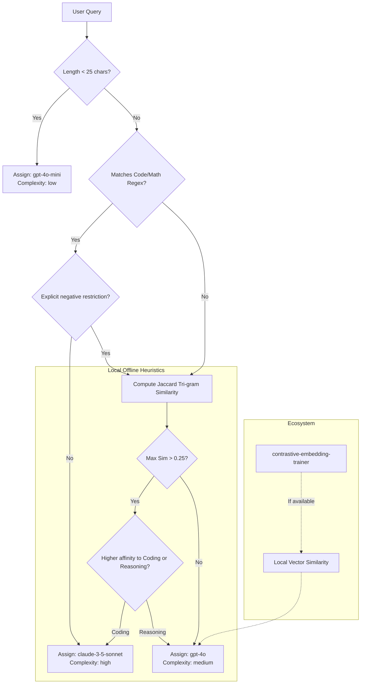

# Semantic Model Router

Intelligent semantic router that analyzes the logical complexity and requirements of user queries in real time to dynamically route them to the most efficient language model (LLM) in terms of cost, latency, and accuracy.

This component substantially reduces the total operating cost of production RAG systems (up to 70% financial savings) by routing simple chat requests or greetings to lightweight, economical models (such as `gpt-4o-mini`), reserving advanced high-intelligence models (such as `claude-3-5-sonnet`) for algorithm solving, code refactoring, or complex logical-deductive reasoning.

## Architecture and Decision Algorithms

The router processes each query through a three-stage hierarchical decision tree, prioritizing local execution, low latency, and offline robustness.


```mermaid
graph TD
    Query[User Query] --> LengthCheck{Length < 25 chars?}
    
    LengthCheck -->|Yes| Mini[Assign: gpt-4o-mini <br/> Complexity: low]
    LengthCheck -->|No| RegexCheck{Matches Code/Math Regex?}
    
    RegexCheck -->|Yes| CodeNegativeCheck{Explicit negative restriction?}
    CodeNegativeCheck -->|Yes| JaccardCheck[Compute Jaccard Tri-gram Similarity]
    CodeNegativeCheck -->|No| Sonnet[Assign: claude-3-5-sonnet <br/> Complexity: high]
    
    RegexCheck -->|No| JaccardCheck
    
    subgraph Local Offline Heuristics
        JaccardCheck --> JaccardCompare{Max Sim > 0.25?}
        JaccardCompare -->|Yes| MaxAnchor{Higher affinity to Coding or Reasoning?}
        MaxAnchor -->|Coding| Sonnet
        MaxAnchor -->|Reasoning| GPT4[Assign: gpt-4o <br/> Complexity: medium]
        JaccardCompare -->|No| GPT4
    end
    
    subgraph Ecosystem
        EmbeddingTrainer[contrastive-embedding-trainer] -.->|If available| RouterEmbeddings[Local Vector Similarity]
        RouterEmbeddings -.-> GPT4
    end
```

### 1. Stage 1: Structural Analysis and Conditional Regex

The router first runs instant lexical checks that don't consume heavy processing resources:

*   **Length Validation:** If the cleaned query is shorter than `25` characters (for example, greetings like "Hi", confirmations like "Yes, thanks"), it is immediately classified as `low` complexity and routed to `gpt-4o-mini`.
*   **Keyword Inspection (Regex):** Specific patterns associated with programming (`def`, `class`, `fn`, `struct`, etc.) or formal mathematical reasoning (`algorithm`, `theorem`, `calculus`) are searched for.
*   **Negation Control:** To avoid false positives when the user explicitly asks *not* to include code (example: "explain how RAG works without any code"), a negative exclusion regular expression is evaluated:
    $$\text{PII\_Neg} = \text{re.search}(\text{"}\setminus b(sin|no|evitar|sin\ usar|sin\ meter)\setminus s+(codigo|programar|programacion|desarrollo)\setminus b\text{"})$$
    If this expression matches, the direct routing to Claude is canceled and analysis continues to the next stage.

### 2. Stage 2: Jaccard N-Gram Similarity (Tri-grams)

When there is no conclusive lexical match, the router applies an offline heuristic based on level-3 character n-grams (tri-grams). This method measures the overlap between the prompt's tri-grams and a set of predefined anchors representing high-complexity intents:

*   **Tri-grams:** A text is broken down into continuous sequences of 3 characters, removing spaces and normalizing to lowercase. For text $T$, we define its set of tri-grams as $G(T)$.
*   **Jaccard Similarity:** Given the user query $Q$ and an anchor text $A$, similarity is defined as:
    $$J(Q, A) = \frac{|G(Q) \cap G(A)|}{|G(Q) \cup G(A)|}$$

The system evaluates similarity against two guiding intents:
1.  *Coding Anchor:* `"Write a programming script to optimize the function or backend"`
2.  *Reasoning Anchor:* `"Perform a step-by-step logical deductive analysis of the financial data"`

If $\max(J(Q, \text{Coding}), J(Q, \text{Reasoning})) > 0.25$, the model with the intelligence profile suited to the dominant anchor is selected (`claude-3-5-sonnet` or `gpt-4o`). Otherwise, it defaults to `gpt-4o` for general-purpose processing.

### 3. Stage 3: Integration with contrastive-embedding-trainer

The router's constructor attempts a dynamic import of the sibling `contrastive-embedding-trainer` project from the workspace. If found available, the router can locally compute query embeddings and map cosine similarity against previously indexed templates instead of relying on tri-gram comparison, significantly improving semantic routing accuracy under complex workloads.

## Models and Cost Profiles

The router manages the budget based on the cost of input and output tokens ($Cost = \alpha \cdot \text{Cost}_{\text{input}} + (1.0 - \alpha) \cdot \text{Cost}_{\text{output}}$). By default, a standard token consumption ratio for RAG tasks is used ($\alpha = 0.75$):

| Model | Intel. Capacity (1-10) | Latency | Input Cost / 1K Tokens | Output Cost / 1K Tokens | Weighted Cost W.A. |
| :--- | :---: | :---: | :---: | :---: | :---: |
| **gpt-4o-mini** | 4 | Low | \$0.00015 | \$0.00060 | \$0.0002625 |
| **gpt-4o** | 8 | Medium | \$0.00500 | \$0.01500 | \$0.0075000 |
| **claude-3-5-sonnet** | 10 | High | \$0.00300 | \$0.01500 | \$0.0060000 |

## Ecosystem Connection

This router integrates into the infrastructure as follows:
1.  **contrastive-embedding-trainer:** Provides the local Bi-Encoder model to encode semantic queries and search for intent in high-dimensional spaces.
2.  **llm-inference-server:** Once the router decides which model to use, calls to local models are routed to the local inference server for processing.
3.  **orchestra-agents:** Acts as the entry gate for agent requests, allowing intermediate agents' reasoning generation to avoid wasting unnecessary quotas on advanced proprietary models.

## Project Structure

*   `router.py`: Implementation of the `SemanticModelRouter` class and the Pydantic data schemas for routing decisions (`RoutingDecision`).
*   `test_router.py`: Unit tests validating complexity classification (low, medium, high), Jaccard similarity calculation, and regex exclusions.
*   `example.py`: Interactive demonstration of routing simulation over multiple test prompts, calculating and displaying the exact projected financial savings percentage.

## Installation and Execution

### 1. Set Up the Environment and Install Dependencies

Make sure to initialize and activate the local virtual environment before proceeding to use the router:

```bash
python3 -m venv .venv
source .venv/bin/activate
pip install -r requirements.txt
```

### 2. Run Unit Tests

```bash
.venv/bin/python -m unittest test_router.py
```

### 3. Run the Financial Savings Demonstration

```bash
.venv/bin/python example.py
```

The script will evaluate a series of predefined queries (code, simple conversational questions, mathematical formulas) and print to the console the model selected for each, the routing justification, and a cumulative cost comparison demonstrating budget optimization.
